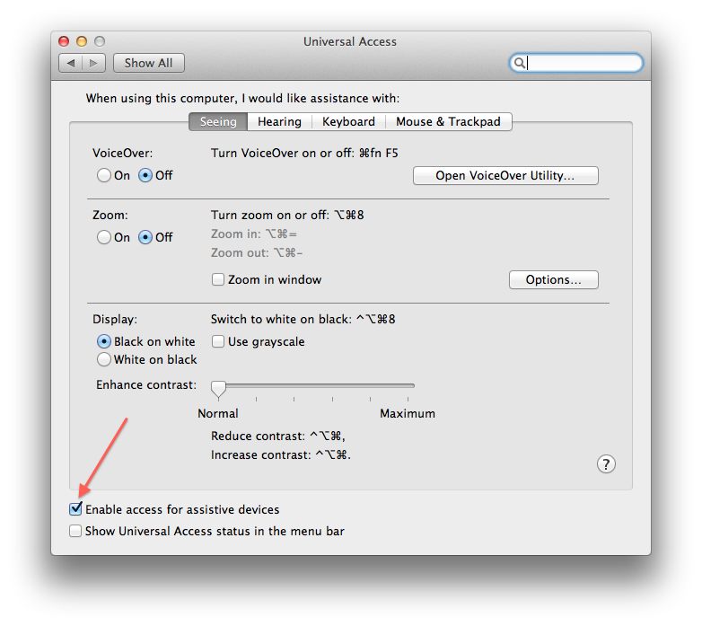

[Previous](installing.html) | [Next](installation-step2.html) 

You will need to turn on the accessibilty features on both your
desktop and the iPhone/iPad simulator. 

Frank uses accessibility labels to identify controls within your app.

* **Desktop** - go to System Preferences -> Universal Access
and Check “Enable access for assistive devices”.

* **Simulator/Device** -  launch the settings app, select General,
   select Accessibility, and then switch the Accessibility Inspector
   to On. 

In the simulator you will now have a little Accessibility Inspector
window permanently overlayed. Annoyingly there’s nothing you can do
about this apart from drag it to one side of the screen.

[Previous](installation-step0.html) | [Next](installation-step2.html) 
