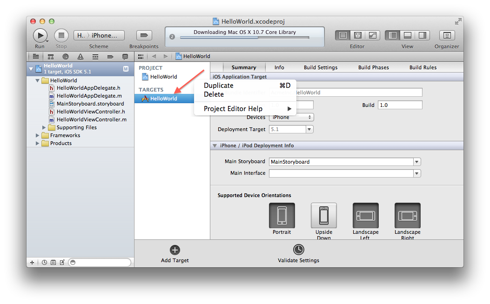

[Previous](installation-step3.html) | [Next](installation-step5.html) 

#### Create a Frankified target
You need to create a seperate XCode app target for a 'Frankified'
version of your app. This Frankified target will link the
[Frank server component](frankly.html) into your app, so that it can be automated. 

In XCode, switch to the Project Navigator by hitting Command-1, and
then select your project by clicking on it. You should now see your
project settings, with one or more targets listed. 

Right-click on your main app target, and select "Duplicate". 

You may be asked if you want to transition to an iPad target. 
If so, select "Duplicate Only". 

You should now see a new target created called `"<YourAppName> copy"`, or
similar. Rename the target to `"<YourAppName> Frankified"`

[Previous](installation-step3.html) | [Next](installation-step5.html) 
