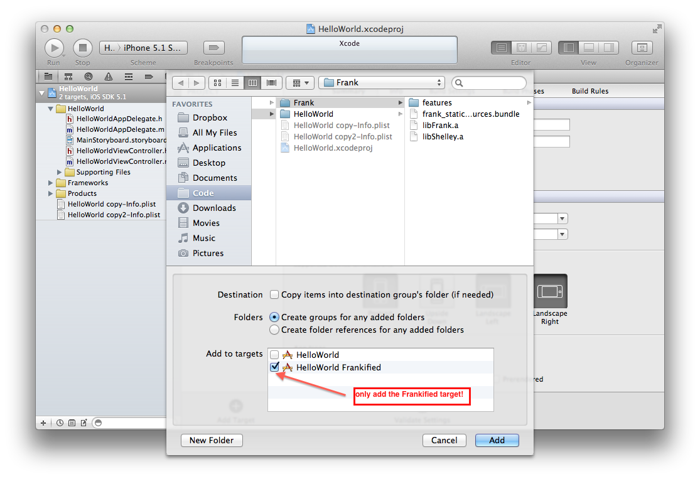

[Previous](installation-step4.html) | [Next](installation-step6.html) 

### Add the Frank server to your Frankified target
Right-click on your project In the Project Navigator at the far left,
choose `"Add Files To <YourAppName>"`. 

Select the Frank directory which you just added to your source
directory in the previous step. 

In the "Add to targets" section at the bottom of the dialog make sure you
check only the Frankified target you just created, and uncheck any
other targets. Now you can click Add.

[Previous](installation-step4.html) | [Next](installation-step6.html) 
