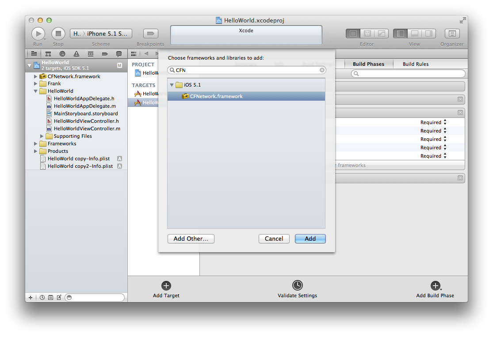

[Previous](installation-step5.html) | [Next](installation-step7.html) 

The Frank server uses the
[CFNetwork framework](https://developer.apple.com/library/mac/#documentation/Networking/Conceptual/CFNetwork/Introduction/Introduction.html). 

If you're app isn't already using it you'll need to add it as a dependency. 

In the Project Navigator, select your project again, select the
"Frankified Target" and select the "Build Phases" tab. 

Expand the "Link Binary With Libraries" section, and click the + icon. 

Select "CFNetwork.framework" from the list of frameworks, then click
Add. 

[Previous](installation-step5.html) | [Next](installation-step7.html) 
