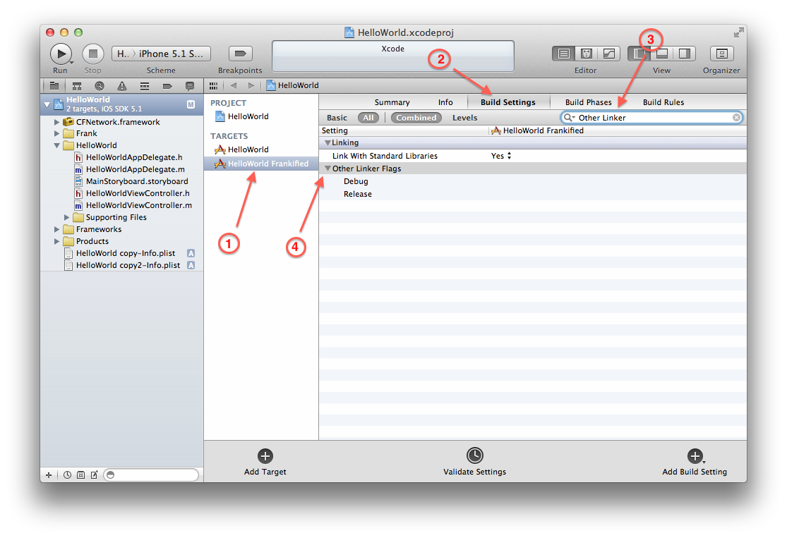

[Previous](installation-step6.html) | [Next](installation-step8.html) 

In the same project settings screen (for the Frankified target),
select the "Build Settings" tab, and find the "Other Linker Flags" entry.  

Add `-all_load` and `-ObjC` flags to the Debug flags.

[Previous](installation-step6.html) | [Next](installation-step8.html) 
