## Step 1 - Turn on Accessibility features

You will need to turn on the accessibility features on the machine hosting your iOS simulator.  Frank leverages accessibility to automate some actions with the simulator (such as rotating the device).

On the machine which will be hosting the iOS Simulator go to System Preferences -> Universal Access
and Check “Enable access for assistive devices”.
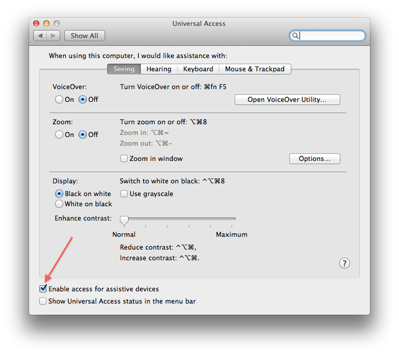

## Step 2 - Install Frank
In a Terminal window, run:


$ gem install frank-cucumber 


This will download and install the [frank-cucumber gem](http://rubygems.org/gems/frank-cucumber). 

**_Depending on your ruby setup you might need to run_**

$ sudo gem install frank-cucumber


We recommend using rvm to manage your ruby setup. If you use rvm there will be no need for `sudo`, and no need to mess with your system install of ruby.

## Step 3 - Run frank-skeleton

At this point, you should create an [XCode project for your app](https://developer.apple.com/library/ios/#referencelibrary/GettingStarted/RoadMapiOS/Introduction/Introduction.html)
(unless you already have a project setup!)

In a Terminal window, cd to your project directory (the folder where the
.xcodeproj file lives) and run `frank-skeleton`: 


$ cd /path/to/my/awesome/app
$ frank-skeleton


This will add a `Frank` subdirectory containing Frank's server code plus some
initial cucumber plumbing to your app (after checking with you first!).

## Step 4 - Create a Frankified target

You need to create a seperate XCode app target for a 'Frankified'
version of your app. This Frankified target will link in the
[Frank server component](frankly.html) into your app as a static library enabling your app to be automated. 

In XCode, switch to the Project Navigator by hitting Command-1, and
then select your project by clicking on it. You should now see your
project settings, with one or more targets listed. 

Right-click on your main app target, and select "Duplicate". 

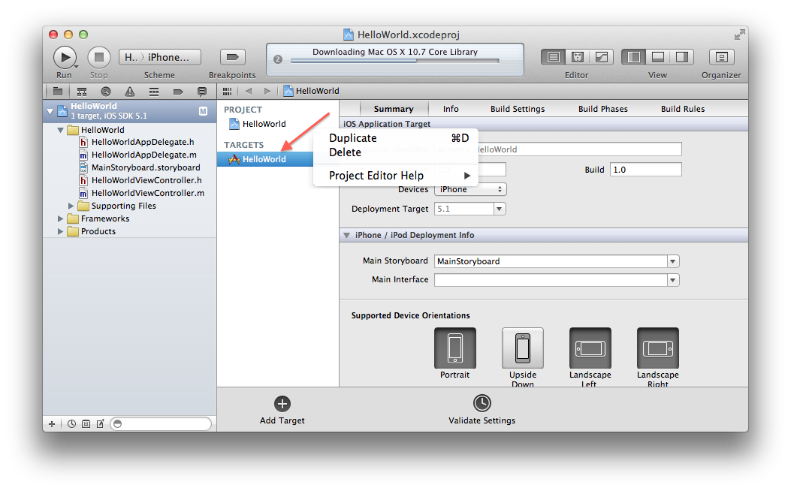

You may be asked if you want to transition to an iPad target. 
If so, select "Duplicate Only". 
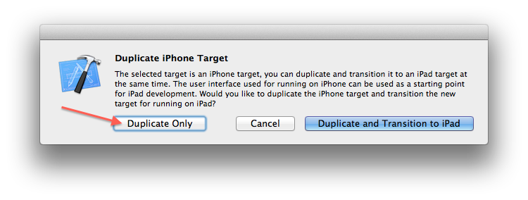

You should now see a new target created called `"<YourAppName> copy"`, or
similar. Rename the target to `"<YourAppName> Frankified"`
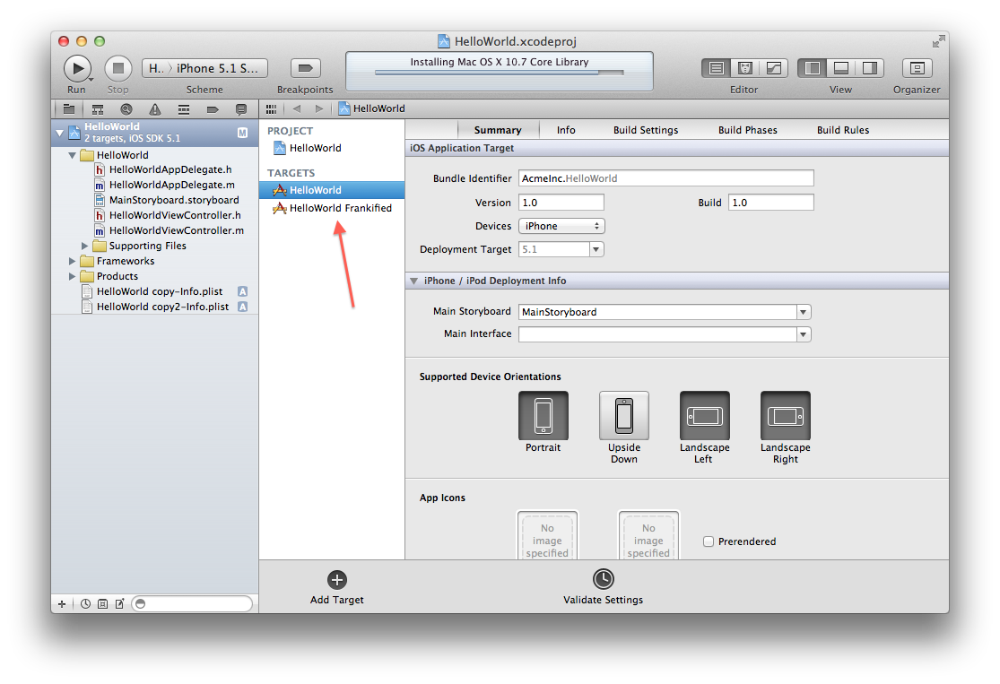

## Step 5 - 'Frankify' your app

### Add the Frank server to your Frankified target
Right-click on your project In the Project Navigator at the far left,
choose `"Add Files To <YourAppName>"`. 
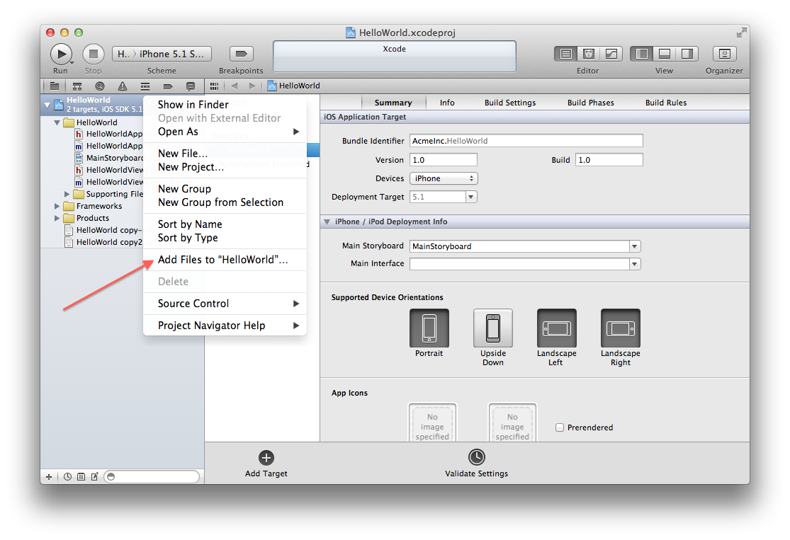

Select the Frank directory which you just added to your source
directory in the previous step. 

In the "Add to targets" section at the bottom of the dialog make sure you
check only the Frankified target you just created, and uncheck any
other targets. Now you can click Add.
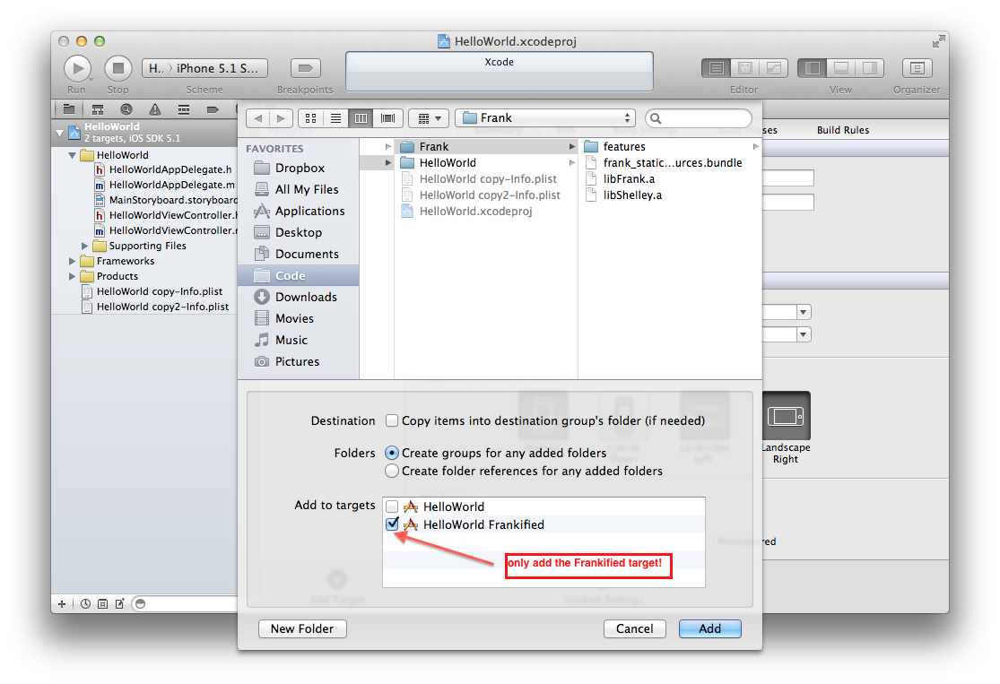

## Step 6 - Add dependencies

The Frank server uses the
[CFNetwork framework](https://developer.apple.com/library/mac/#documentation/Networking/Conceptual/CFNetwork/Introduction/Introduction.html). 

If you're app isn't already using it you'll need to add it as a dependency. 

In the Project Navigator, select your project again, select the
"Frankified Target" and select the "Build Phases" tab. 

Expand the "Link Binary With Libraries" section, and click the + icon. 

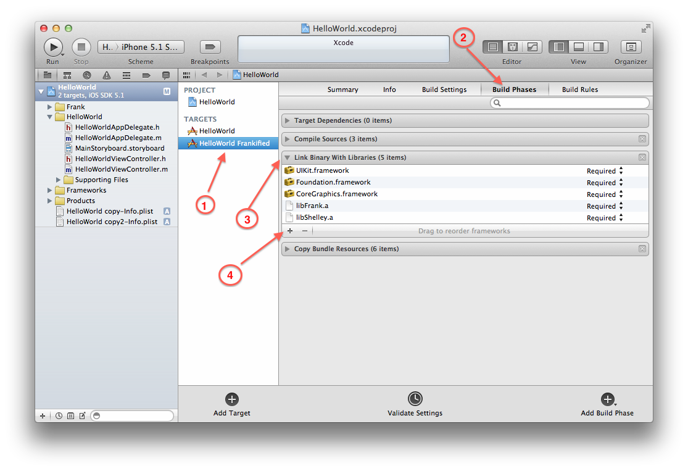

Select "CFNetwork.framework" from the list of frameworks, then click
Add. 
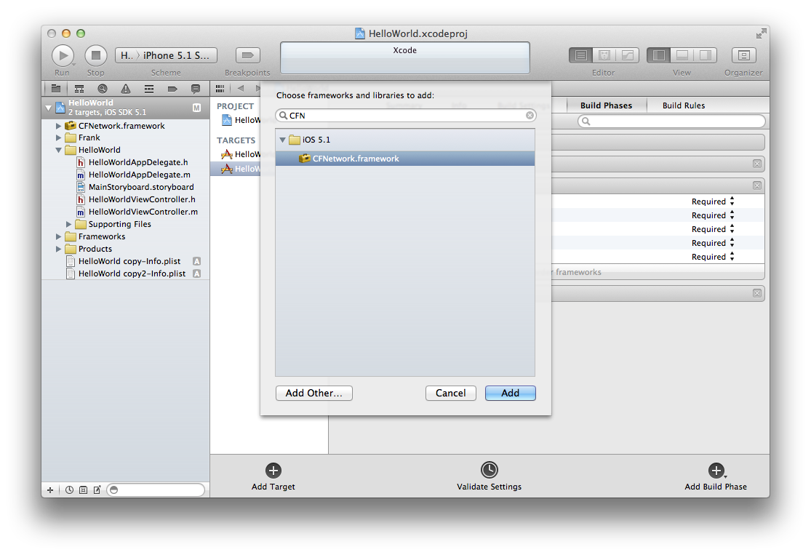

## Step 7 - Add linker flags

In the same project settings screen (for the Frankified target),
select the "Build Settings" tab, and find the "Other Linker Flags" entry.  
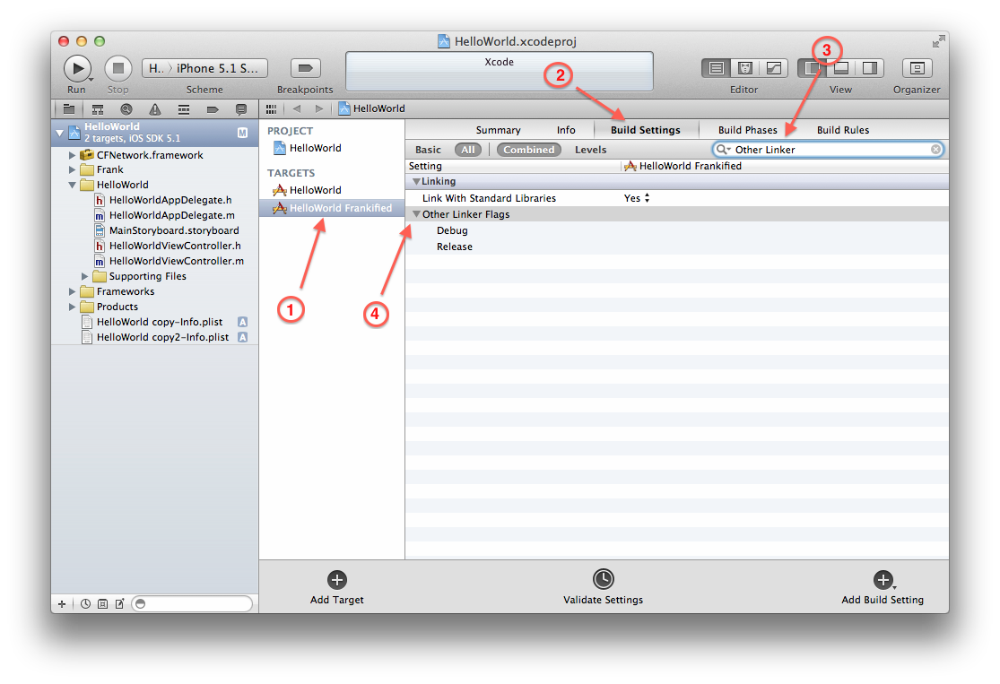

Add `-all_load` and `-ObjC` flags to the Debug flags.
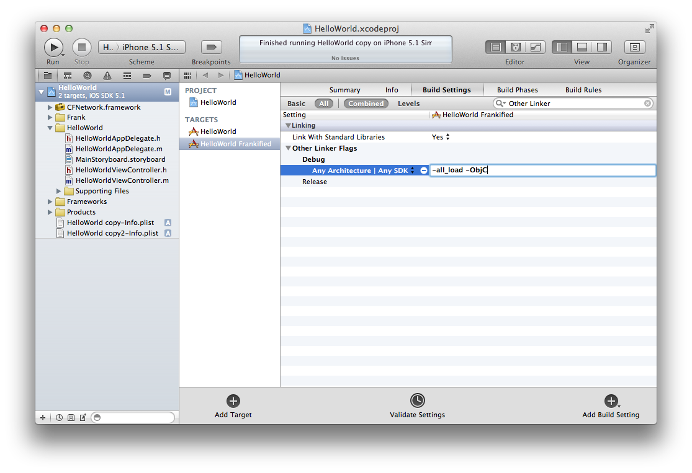

## Step 8 - Test 'er out!

You are almost done at this point. 

Select the Frankified target<strong>1</strong> from the Scheme Selector (at the top, just to the right of the Run and
Stop buttons), then hit Run. You should see your app build and launch as normal.
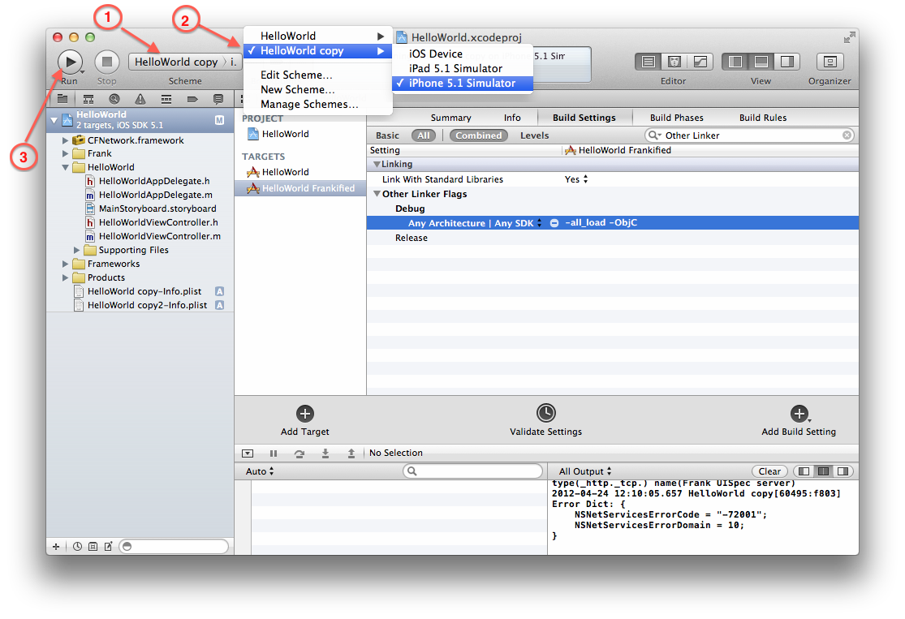

If you now open up [http://localhost:37265](http://localhost:37265) in a browser
you should see your app presented to you by Symbiote, the app
inspector embedded within Frank! 

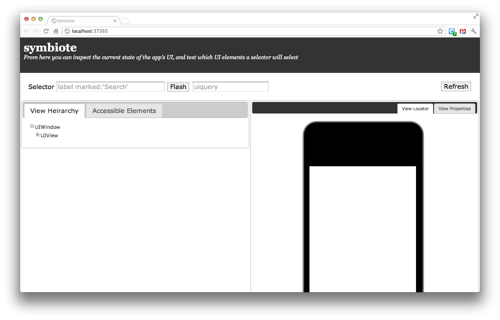

That means you've successfully Frankified your application. 

Congratulations! You're ready to write [Cucumber stories](user_stories.html) and automate
 your iOS testing!

**\[1\]** XCode might not show the right name in the Scheme Selector. In XCode 4.3, it shows *"YourAppName Copy"* instead
of *"YourAppName Frankified"* as it should!

## Step 9 - exporting your frankified app's bundle location

Frank needs to know where your compiled application bundle lives so that it can launch and relaunch the app during testing. Unfortunately by default Xcode 4 will save your compiled app bundle to a rather obscure location. One easy way to let Frank know where your compiled app bundle lives is to add a phase to your Frankified build which will write a little ruby configuration file containing the app bundle's location. If we save that file in the cucumber support folder then it will be read each time you execute your cucumber tests.

In the Project Navigator, select your project, select the "Frankified Target" and select the "Build Phases" tab. Click the "Add Build Phase" button at the bottom right and choose "Add Run Script" from the dropdown menu. Add the following to the script contents (where it says "Type a script or drag a script file from your workspace"):


  echo APP_BUNDLE_PATH=\"$BUILT_PRODUCTS_DIR/$EXECUTABLE_NAME.app\" > $SRCROOT/Frank/features/support/bundle_path.rb


## Step 10 - Running your first Cucumber feature

So, you have your app all Frankified and ready to be tested!
Lets run our first Cucumber feature!

From the Frank skeleton directory within your app, run cucumber


cd /path/to/your/app/Frank
cucumber


Cucumber will attempt to run the feature that has
been pre-defined (when you ran the `frank-cucumber` command) in `features/my_first.feature` 

It is likely that Cucumber will not run on the first attempt since it
requires a variable named `APP_BUNDLE_PATH` to be defined.

`APP_BUNDLE_PATH` must contain the complete path to where the
Frankified app bundle lives (e.g /path/to/HelloWorld Frankified.app)

To set `APP_BUNDLE_PATH`, you can edit the file
`features/support/env.rb` and set
`APP_BUNDLE_PATH=/path/to/your-frankified-app-name.app` 

Rerun the `cucumber` command and you should see the iOS simulator gets
fired up and put through the steps defined in the sample feature! 

To help you get started, Frank comes with a bunch of
[predefined steps](supplied_steps.html) such as:

When I touch "([^\"]*)"
When I type "([^\"]*)" into the "([^\"]*)" text field


Browse around this site to get more info. Happy testing :)
